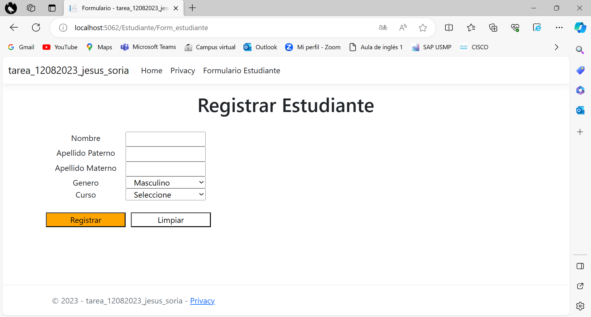
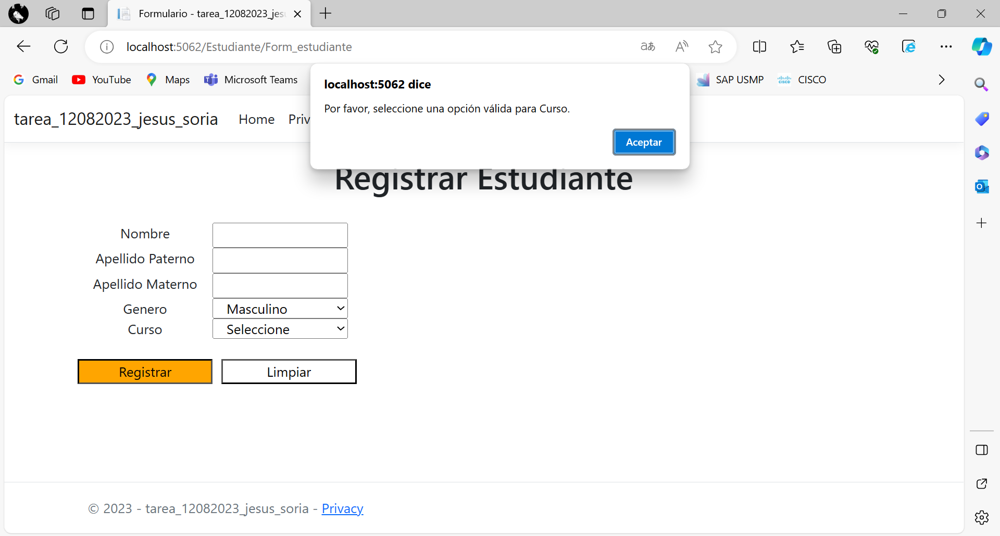
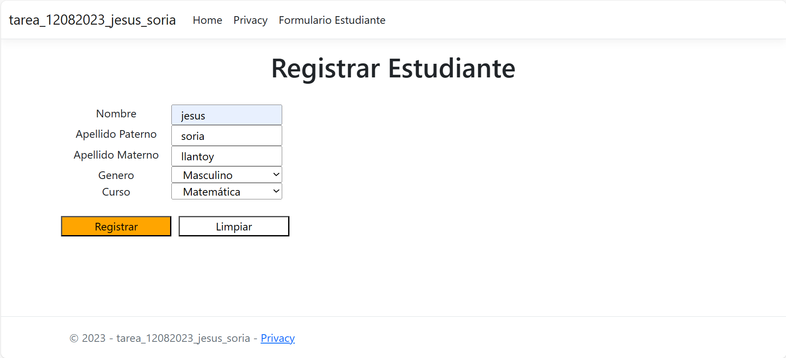
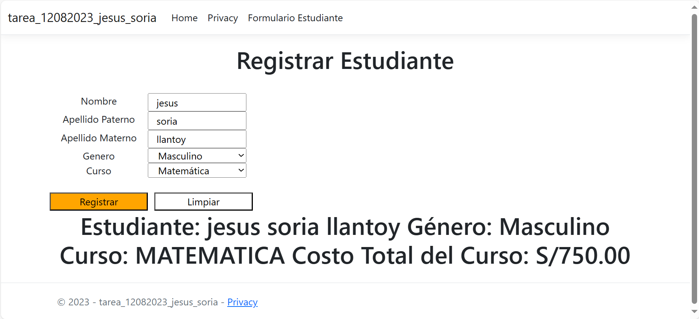

# Tarea
Tarea del 12 de agosto del 2023

git init
git remote add origin https://github.com/jesus73514145/Tarea.git
git add .
git commit -m "Archivos iniciales" -m "Co-authored-by: AlbertoSoria1998 <albertosoriasoria74@gmail.com>"

git push origin master

